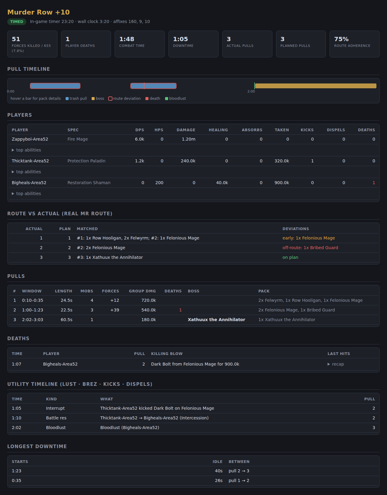

# Postmortem

**Mythic+ route post-mortem companion.** Import your MDT (Mythic Dungeon
Tools) route, let the companion parse `WoWCombatLog.txt` after (or during)
the run, and see exactly where your actual pulls deviated from the plan —
plus damage, healing, deaths with recaps, interrupts, cooldown usage,
forces progress and downtime.

Pure Python 3.10+, zero runtime dependencies.



## Install

```bash
pip install .
# or during development:
pip install -e ".[dev]" && pytest
```

## Quick start

```bash
# 1. One-time: extract dungeon/enemy data from your MDT addon install
#    (maps MDT pull indices to NPC ids, names and enemy-forces counts)
postmortem extract-data "C:/Program Files (x86)/World of Warcraft/_retail_/Interface/AddOns/MythicDungeonTools" -o mdt_data.json

# 2. Check your route (paste the MDT export string, or a file containing it)
postmortem import-route '!~MDT2~...' --dungeon-data mdt_data.json

# 3. After the run: full post-mortem
postmortem analyze "path/to/Logs/WoWCombatLog.txt" \
    --route route.txt --dungeon-data mdt_data.json \
    --format text,html,json --out reports/

# optional: pull the addon's self-built interruptible/uninterruptible spell
# database out of its SavedVariables, then pass it to `analyze` for exact
# kick-efficiency accounting (see "Kick efficiency" below)
postmortem extract-interrupts "WTF/Account/<ACCOUNT>/SavedVariables/Postmortem.lua" -o interrupt_data.json
postmortem analyze ... --interrupt-data interrupt_data.json

# ...or record live while you play (saves each run to its own file and
# auto-analyzes the moment the key ends)
postmortem record "path/to/Logs/WoWCombatLog.txt" \
    --route route.txt --dungeon-data mdt_data.json --analyze --out runs/
```

`postmortem runs <log>` lists every M+ run found in a log so you can
pick one with `analyze --run N` (default: the last run).

### In-game setup

WoW only writes `WoWCombatLog.txt` while combat logging is on:

- type `/combatlog` before the key (or use an addon that auto-enables it), and
- turn on **advanced combat logging** (Options → Network) — this adds unit
  positions and HP to the log, which improves death recaps and pull mapping.

## In-game addon

`addon/Postmortem/` is a real WoW addon, developed in this repo and
symlinked into your live AddOns folder so edits here are testable in-game
with `/reload` — no manual copying:

```bash
ln -s "$(pwd)/addon/Postmortem" \
  "/Applications/World of Warcraft/_retail_/Interface/AddOns/Postmortem"
```

(adjust the WoW path for your platform/install location). It's independent
of the Python tool above — no shared code, just a companion that runs live
in-game:

- **Recording helper** — auto-toggles combat logging (and advanced combat
  logging) on at `CHALLENGE_MODE_START`, off at completion/reset, so
  `/combatlog` is never forgotten before a key.
- **Live stats overlay** — a small draggable window shown only during a key:
  forces progress, timer, death count (with time lost), and interrupt count.
- **Route progress** (needs [MythicDungeonTools](https://www.curseforge.com/wow/addons/mythic-dungeon-tools)
  installed and a route selected for the current dungeon) — "Pull N / M"
  against your currently-selected MDT route, plus a coarse size-mismatch
  signal when a pull looks bigger or smaller than planned. This is
  pull-count/clone-count tracking only, not identity-level deviation
  detection (early/off-route/missed by specific pack, the way the Python
  report above works) — MDT's per-dungeon NPC data lives on its own private
  addon table and isn't accessible from outside it, so this addon can't
  resolve *which* pack you pulled, only how many enemies and which pull
  number.

Click the minimap icon (or run `/pm`) to open an in-game window laying out
exactly what's live in the addon vs. what needs the companion app.

No settings UI yet; toggle `combatLoggingEnabled` in
`PostmortemDB.global` directly if you want to disable the recording
helper. There's no automated test suite for this half of the project (WoW's
Lua API isn't something `pytest` can exercise) — correctness here leans on
grounding every API call in real, currently-shipping addon behavior and on
in-game testing.

## What you get

- **Route vs. actual** — every actual pull is matched against the planned
  MDT pulls: mobs **pulled early** (taken from a later planned pull), packs
  **picked up late**, **off-route** packs the plan never contained, planned
  packs that were **never engaged**, and untracked mid-fight summons. Plus
  an overall route-adherence percentage.
- **Pull detection** — engagement windows per enemy GUID, grouped into
  pulls, with boss fights labeled from `ENCOUNTER_START/END`.
- **Per-player stats** — damage (with per-spell and per-pull breakdown),
  healing + overhealing + absorbs, damage taken, DPS/HPS, interrupts,
  dispels, deaths; specs/roles resolved from `COMBATANT_INFO`.
- **Deaths** — killing blow and a last-hits recap with remaining HP.
- **Avoidable damage** — `analyze --avoidable-data FILE` tags spell ids as
  "stand in the fire" mechanics (a small community/user-maintained JSON
  file, format + example in `docs/avoidable_spells.example.json`) and
  breaks out each player's damage taken from just those spells, with hit
  counts; omit the flag and the report is unaffected.
- **Kick value** — each interrupt is priced: the estimated damage (or enemy
  healing) it prevented, based on the average amount per completed cast of
  that spell observed elsewhere in the same run — the up-front hit plus its
  periodic (DoT/HoT) component per application — with per-player totals.
  Zero-damage debuffs (CC, curses) are reported as prevented applications;
  spells that never landed in the run honestly get no number.
- **Timelines** — bloodlust, battle resses, kicks and dispels; the full
  per-cast timeline is included in the JSON report.
- **Kick efficiency** — every enemy hard-cast is tracked from
  `SPELL_CAST_START` to its outcome: kicked, got through, or died
  mid-cast; per-spell table plus an overall efficiency percentage. With
  `--interrupt-data` (the addon's self-built database, via
  `extract-interrupts`), spells confirmed genuinely uninterruptible are
  excluded outright instead of looking like missed kicks, and confirmed-
  interruptible spells count toward efficiency even if never kicked this
  run; without it, falls back to counting only spells kicked at least once.
- **Boss attempts** — encounter table with kills, wipes and durations.
- **Per-player extras** — killing blows, casts per minute, purges vs.
  dispels, boss-damage share, potions/healthstones used, approximate
  distance traveled, and buff uptimes (Bloodlust included).
- **Death cost** — deaths priced in timer seconds (`--death-penalty`,
  default 15 s), plus biggest hit and last-5-seconds burst per death.
- **Forces** — enemy-forces count progress over time vs. the required
  total (needs the extracted dungeon data).
- **Downtime** — the gaps between pulls where the timer kept running.
- **Positions** — per-player position samples in the JSON (advanced
  logging), groundwork for route-vs-actual map overlays.
- **Run history** — `postmortem index reports/` builds a static
  history webpage over all saved reports: filterable, sortable, with
  per-dungeon best keys and links into each run's HTML report.
- **Raider.io** — `analyze --raiderio us` (or eu/kr/tw/cn) adds each
  player's current M+ score and season best from the public Raider.io
  API; optional and failure-tolerant.
- **Video capture hooks** — `record --on-run-start/--on-run-end CMD`
  fires shell commands exactly at key start/end (with `MA_ZONE`,
  `MA_LEVEL`, `MA_PATH` in the environment). Point them at
  [obs-cmd](https://github.com/grigio/obs-cmd) and every key records its
  own video: `--on-run-start "obs-cmd recording start" --on-run-end
  "obs-cmd recording stop"`.

See [ROADMAP.md](ROADMAP.md) for where this is headed (hosted history,
deeper Raider.io integration, native OBS control, map overlays).
- **Reports** — terminal text, machine-readable JSON, and a self-contained
  dark-mode HTML page with a pull timeline (deviations outlined, deaths and
  lust marked).

## MDT string formats

All three MDT export wire formats are supported and auto-detected:

| Prefix     | Encoding                                            |
|------------|-----------------------------------------------------|
| `!~MDT2~`  | Base64 → Deflate → CBOR (current MDT)               |
| `!`        | LibDeflate print-encoding → Deflate → AceSerializer |
| *(none)*   | LibCompress + AceSerializer (very old exports; only the uncompressed variant — re-export from current MDT otherwise) |

`postmortem.mdt` contains stdlib-only implementations of CBOR,
AceSerializer-3.0 and LibDeflate's printable encoding (both directions, so
you can also re-encode modified routes).

## Notes & limitations

- Route↔NPC resolution requires the extracted `mdt_data.json`; without it
  you still get pulls, stats, deaths, etc., just not the plan comparison
  or forces counts.
- Pull grouping is heuristic (default: engagements separated by <5 s of
  ongoing combat merge into one pull; tune with `--pull-gap`).
- Damage totals count what landed on hostile NPCs from your group,
  attributing pets/guardians to their owners where the log identifies them.
- Both old (`4/20 21:23:41.301`) and new (`4/20/2026 21:23:41.301-4`)
  combat-log timestamp formats are handled.

## Development

```
src/postmortem/
  mdt/         MDT string decoding (cbor, ace_serializer, print_codec),
               route model, dungeon-data extraction from the addon's Lua
  combatlog/   WoWCombatLog tokenizer, event accessors, GUIDs, run splitting
  analysis/    pull detection, route comparison, stats engine
  report/      text + self-contained HTML renderers
  recorder.py  live log tailing / per-run recording
  cli.py       command line interface
```

Run the tests with `pytest` — they cover the codecs (with known byte
vectors), the Lua extractor, the log parser, and a synthetic end-to-end
M+ run with deliberate route deviations.

## Public run tracker

`site/` is a small FastAPI service where anyone can upload an analyzed
report and browse everyone's runs — a public, no-account feed of every
uploaded run plus each run's full report page. Point `analyze` at a
deployed instance to upload automatically:

```bash
postmortem analyze "path/to/Logs/WoWCombatLog.txt" --upload https://your-tracker.example
```

See [site/README.md](site/README.md) for local development and the
Fly.io deploy runbook.
